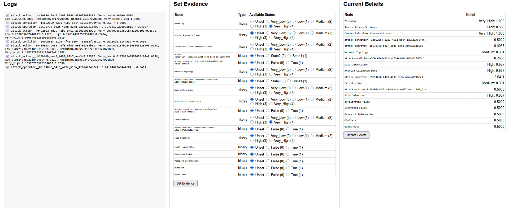
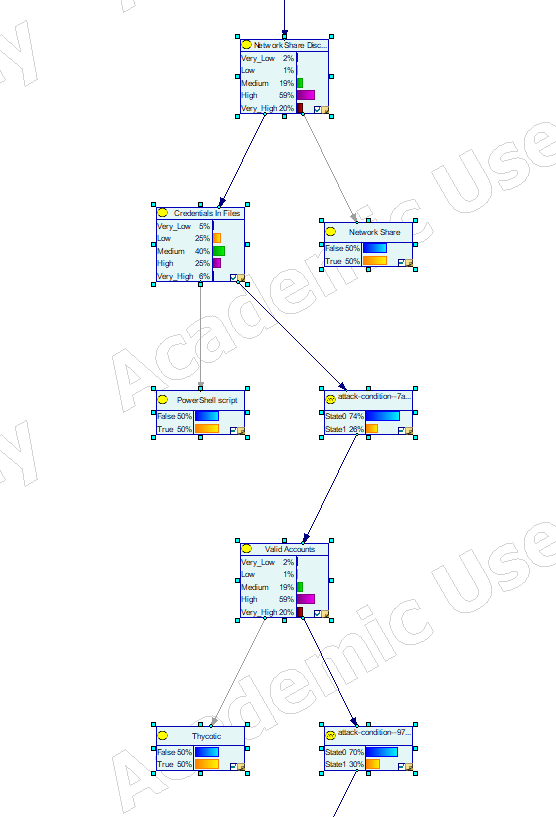
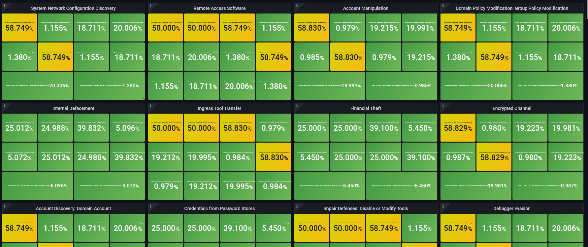

# Fuzzy Bayesian Network Integration for MITRE ATT&CK

A system that integrates fuzzy logic with Bayesian Networks to model MITRE ATT&CK tactics and techniques, providing probabilistic assessments of attack success rates based on environmental factors.


*Flask web interface showing Bayesian Network nodes and their probability distributions*

## Overview

This project combines fuzzy logic systems with Bayesian Network modeling to create dynamic, context-aware probability distributions for cybersecurity attack scenarios. It processes MITRE ATT&CK Flow JSON files and generates probabilistic models that account for environmental factors like detection difficulty, skill requirements, and resource availability.

## Key Features

### 🧠 **Fuzzy Logic Integration**
- **5-State Fuzzy System**: Very_Low, Low, Medium, High, Very_High success probabilities
- **Context-Aware Parameters**: Detection difficulty, skill requirements, resource availability, network monitoring, etc.
- **Dynamic Distributions**: Probabilities adjust based on environmental conditions

### 🔗 **Bayesian Network Generation**
- **XDSL Output**: Compatible with SMILE/GeNIe for analysis and inference
- **Parent Influence**: Child nodes influenced by parent tactic success states
- **Mixed Node Types**: Supports both fuzzy (5-state) and binary (2-state) nodes
- **Complex Relationships**: Handles partition groups, logic groups, and divorce groups


*Generated Bayesian Network visualized in SMILE GeNIe showing attack flow relationships*

### 📊 **Advanced CPT Calculation**
- **Weighted Parent Influence**: Higher parent states increase child success probabilities
- **Influence Mapping**: Very_Low (0.0) → Very_High (1.0) on 0-1 scale
- **Distribution Shifting**: 
  - Low influence (< 0.3): Shifts toward lower success states
  - High influence (> 0.7): Shifts toward higher success states
  - Medium influence: Uses base fuzzy distribution

## How Fuzzy State Influence Works

### State-to-Influence Mapping
```
Very_Low  (state 0) → influence = 0.00
Low       (state 1) → influence = 0.25  
Medium    (state 2) → influence = 0.50
High      (state 3) → influence = 0.75
Very_High (state 4) → influence = 1.00
```

### Parent Impact on Child Nodes
When a parent node is in **Very_High** state:
- **Influence = 1.00** (maximum positive influence)
- **Child distribution shifts toward higher success states**
- **Example**: Base `[0.05, 0.25, 0.4, 0.25, 0.05]` becomes `[0.041, 0.2365, 0.391, 0.2635, 0.068]`

When a parent node is in **Very_Low** state:
- **Influence = 0.00** (maximum negative influence)  
- **Child distribution shifts toward lower success states**
- **Example**: Base distribution shifts more probability to Very_Low and Low states

## Installation

1. **Clone the repository**
   ```bash
   git clone <repository-url>
   cd FuzzBNTest
   ```

2. **Create virtual environment**
   ```bash
   python -m venv .venv
   .venv\Scripts\activate  # Windows
   # source .venv/bin/activate  # Linux/Mac
   ```

3. **Install dependencies**
   ```bash
   pip install -r requirements.txt
   ```

4. **Install PySmile**
   ```bash
   python -m pip install --no-cache-dir --index-url https://support.bayesfusion.com/pysmile-A/ pysmile
   ```

5. **Configure PySmile License**
   - Place your PySmile license P-file where the `import pysmile_license` statement can load it
   - Recommended location: both in bn_creator and flask_app directories

6. **Install Attack Flow (if not successful through requirements.txt)**
   ```bash
   git clone https://github.com/center-for-threat-informed-defense/attack-flow.git
   cd attack-flow
   pip install poetry  # Install poetry if not already installed
   poetry install
   ```

7. **Collect Attack Flow JSON files**
   ```bash
   python ./bn_creator/collect_json_flows.py
   ```

8. **Configure Grafana API Token (for web interface)**
   - Get a Grafana API token
   - Update `user_interface.py` with your token:
     ```python
     api_key="<YOUR_GRAFANA_ACCESS_TOKEN>"
     ```
## Usage

### Basic Usage
```bash
python usage.py
```

This will:
1. Load MITRE ATT&CK Flow JSON files from `downloaded_attack_flow_jsons/`
2. Generate fuzzy probability distributions for each tactic
3. Build a Bayesian Network with proper CPT calculations
4. Export to `attack_flow_model.xdsl`
5. Display detailed fuzzy analysis in terminal

### Web Interface
The system includes a Flask web application for interactive analysis:
```bash
# Launch web service when prompted
# Navigate to http://localhost:5000
```

## Project Structure

```
FuzzBNTest/
├── bn_creator/
│   ├── fuzzy_bn_integration.py    # Main BN builder with fuzzy logic
│   ├── fuzzy_tactics_system.py    # Fuzzy logic system for tactics
│   ├── noisy_adder.py            # Noisy-MAX/Noisy-OR implementations
│   └── pysmile_license.py        # PySmile license configuration
├── downloaded_attack_flow_jsons/  # MITRE ATT&CK Flow JSON files
├── flask_app/                     # Web interface
├── usage.py                       # Main execution script
├── requirements.txt               # Python dependencies
└── attack_flow_model.xdsl        # Generated Bayesian Network
```

## Key Components

### FuzzyBNBuilder
The main class that extends traditional BN building with fuzzy logic:
- **Tactic Identification**: Automatically identifies MITRE ATT&CK tactics
- **Fuzzy Parameter Extraction**: Maps technique properties to fuzzy inputs
- **CPT Generation**: Creates probabilistic conditional probability tables
- **Parent Influence**: Implements weighted influence from parent nodes

### FuzzyTacticsSystem
Manages fuzzy logic calculations for different tactics:
- **Tactic-Specific Rules**: Each tactic has customized fuzzy rules
- **Environmental Parameters**: Considers detection, monitoring, skill requirements
- **Membership Functions**: Triangular and trapezoidal membership functions
- **Defuzzification**: Converts fuzzy outputs to crisp probability distributions

## Recent Improvements

### ✅ **Fixed CPT Overwriting Issue**
- **Problem**: Fuzzy distributions were being overwritten by group handlers
- **Solution**: Modified `_set_all_cpts()` to force fuzzy CPT setting for tactic nodes
- **Result**: Terminal output now matches XDSL output perfectly

### ✅ **Enhanced Parent Influence**
- **Weighted State Impact**: Each fuzzy state has proportional influence on children
- **Realistic Probability Shifts**: Subtle but meaningful distribution adjustments
- **Proper CPT Ordering**: Fixed parent state combination ordering for PySmile compatibility

### ✅ **Robust Parameter Handling**
- **Tactic-Specific Inputs**: Only include parameters each tactic actually uses
- **Fallback Mechanisms**: Graceful handling of missing or invalid parameters
- **Error Recovery**: Comprehensive error handling with informative debug output

## Output Analysis

### Terminal Output
- **Detailed Fuzzy Distributions**: Visual bar charts for each tactic
- **Parameter Information**: Shows fuzzy inputs used for each technique
- **Tactic Summaries**: Aggregated statistics by MITRE ATT&CK tactic
- **Debug Information**: Comprehensive logging for troubleshooting

### XDSL File
- **SMILE/GeNIe Compatible**: Can be opened in professional BN software
- **Proper CPTs**: Accurate conditional probability tables with fuzzy influence
- **Node Metadata**: Includes fuzzy parameters and distributions in node descriptions
- **Network Structure**: Preserves attack flow relationships and dependencies

## Getting Started

### Prerequisites

- **PySmile**: Bayesian Network engine (requires license)
- **scikit-fuzzy**: Fuzzy logic system implementation
- **NumPy**: Numerical computations
- **Flask**: Web interface framework
- **Prometheus**: Metrics collection system
- **Prometheus Pushgateway**: Metrics gateway for batch jobs
- **Grafana**: Dashboard visualization (optional)
- **Matplotlib**: Visualization (optional)

### Installation

1. **Install Python Dependencies**
   ```bash
   pip install -r requirements.txt
   ```

2. **Configure PySmile License**
   - Edit `bn_creator/pysmile_license.py` with your license information

3. **Download and Setup Prometheus**
   - Download Prometheus from https://prometheus.io/download/
   - Extract to a directory (e.g., `C:\prometheus`)

4. **Download and Setup Prometheus Pushgateway**
   - Download Pushgateway from https://prometheus.io/download/
   - Extract to a directory (e.g., `C:\pushgateway`)

### Startup Instructions

**⚠️ Important: Follow this exact order and use separate terminals for each component**

#### Terminal 1: Prometheus Pushgateway
```powershell
# Navigate to pushgateway directory
cd C:\pushgateway

# Start Pushgateway (default port 9091)
.\pushgateway.exe
```

#### Terminal 2: Prometheus Server
```powershell
# Navigate to prometheus directory
cd C:\prometheus

# Start Prometheus server (default port 9090)
# Make sure prometheus.yml is configured to scrape pushgateway at localhost:9091
.\prometheus.exe --config.file=prometheus.yml
```

#### Terminal 3: Flask Application
```powershell
# Navigate to project directory
cd C:\Users\wlepp\OneDrive\Desktop\MITREAttackFlowtoFuzzyBN

# Activate virtual environment (if using one)
.\venv\Scripts\Activate.ps1

# Start Flask application
python flask_app\bn-ws.py
```

#### Terminal 4: Main Application
```powershell
# Navigate to project directory
cd C:\Users\wlepp\OneDrive\Desktop\MITREAttackFlowtoFuzzyBN

# Activate virtual environment (if using one)
.\venv\Scripts\Activate.ps1

# Run the main application
python user_interface.py
```

### Why Separate Terminals?

**🔧 Process Independence**
- Each component runs as an independent process with its own lifecycle
- If one component crashes, others continue running unaffected
- Easier to restart individual components without affecting the entire system

**📊 Monitoring & Debugging**
- **Separate Log Streams**: Each terminal shows dedicated logs for its component
- **Real-time Metrics**: Monitor Prometheus scraping, Flask requests, and application events independently
- **Performance Isolation**: Identify which component is causing performance issues

**🔄 Development Workflow**
- **Hot Reloading**: Restart Flask app without stopping Prometheus infrastructure
- **Configuration Changes**: Modify Prometheus config and restart only that component
- **Testing**: Test individual components in isolation

**🚀 Production Readiness**
- **Service Architecture**: Mimics microservices deployment patterns
- **Scalability**: Each component can be scaled independently
- **Resource Management**: Monitor CPU/memory usage per component

### Verification Steps

1. **Check Pushgateway**: Visit http://localhost:9091 - should show metrics interface
2. **Check Prometheus**: Visit http://localhost:9090 - should show Prometheus UI with targets
3. **Check Flask App**: Visit http://localhost:5000 - should show Bayesian Network interface
4. **Verify Metrics Flow**: 
   - Run `user_interface.py` to generate attack flow
   - Check Flask app updates metrics
   - Verify Prometheus scrapes metrics from Pushgateway
   - Confirm metrics appear in Prometheus UI

### Access Points

- **Flask Web Interface**: http://localhost:5000
- **Prometheus Server**: http://localhost:9090
- **Prometheus Pushgateway**: http://localhost:9091
- **Generated XDSL File**: `attack_flow_model.xdsl`
- **Grafana Dashboard**: Import generated JSON from `dashboard_generator.py`


*Grafana dashboard displaying real-time metrics from the Bayesian Network nodes*

## Dependencies

## License

This project requires a PySmile license for Bayesian Network functionality. Configure your license in `bn_creator/pysmile_license.py`.

## Contributing

1. Fork the repository
2. Create a feature branch
3. Make your changes
4. Add tests if applicable
5. Submit a pull request

## Troubleshooting

### Common Issues

**"Unexpected input" errors**: Ensure fuzzy parameters match tactic expectations
**CPT setting failures**: Check parent node state counts and ordering
**License errors**: Verify PySmile license configuration

### Debug Mode
Enable detailed debug output by checking the console during execution. The system provides comprehensive logging for fuzzy calculations, CPT generation, and network building.

---

*For more information about MITRE ATT&CK, visit: https://attack.mitre.org/*
